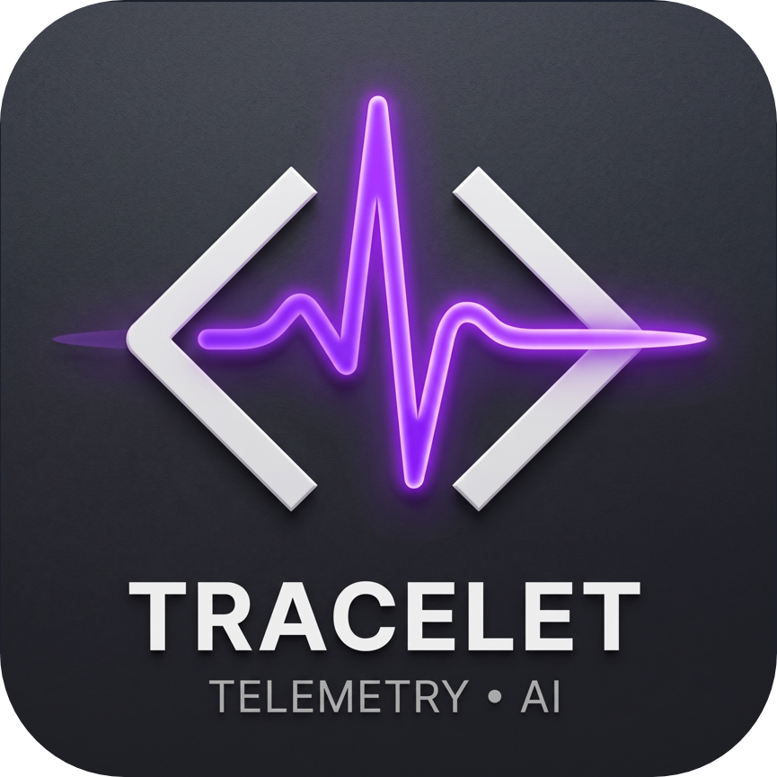

<div align="center">
  
  <h1>Tracelet</h1>
  <p><strong>Bridge LLM observability platforms with your IDE.</strong></p>

  <p>
    <a href="https://marketplace.visualstudio.com/items?itemName=tracelet.tracelet"></a>
    <a href="https://github.com/satwiksps/tracelet/blob/main/LICENSE"></a>
    
  </p>
</div>

---

Tracelet is a native VS Code extension built for AI engineers, LLMOps practitioners, and backend developers. It acts as a direct bridge between cloud-based LLM observability platforms and the local development environment, drastically reducing the friction of debugging complex AI workflows.

## Features

### Native Prompt Diff Analyzer
Experience a side-by-side comparison of your static prompt templates versus the fully hydrated prompts sent to the LLM at runtime. Tracelet leverages VS Code's native diff editor, eliminating the need for external tools.
- **Left panel:** Your template with placeholder variables.
- **Right panel:** The exact prompt payload transmitted to the API.

### Virtual Trace Documents
Runtime payloads are served into temporary virtual tabs using a custom URI scheme. This prevents massive JSON logs from cluttering your local workspace.

### Actionable CodeLens Integration
Tracelet scans Python and TypeScript files for standard LLM invocation signatures and injects clickable CodeLens annotations directly above function definitions. This provides one-click access to the most recent execution traces.

Supported patterns include:
- `client.chat.completions.create()` (OpenAI)
- `client.messages.create()` (Anthropic)
- `chain.invoke()`, `llm.invoke()` (LangChain)
- `generateText()`, `streamText()` (Vercel AI SDK)
- `@traceable`, `@observe` decorators

### Inline Token Heatmaps
A visual overlay highlights token consumption intensity per code region. The color-coded gradient scales from low to high usage, accompanied by hover tooltips that display exact token metrics and percentages.

### Trace Explorer Sidebar
A dedicated activity bar panel allows for browsing traces in a hierarchical tree view. Traces are organized as a span tree with distinct icons for each execution type (LLM, Chain, Tool, Retriever, Agent).

### Rich Trace Detail Panel
An interactive webview presents a Gantt-style timeline of all spans within a trace, offering clickable navigation back to the originating source code.

---

## Python SDK (`tracelet-sdk`)

Tracelet comes with a companion Python package that auto-instruments your LLM code and writes local traces automatically. No cloud accounts required.

```bash
pip install tracelet-sdk
```

```python
import tracelet
tracelet.init() # That's it!

from openai import OpenAI
client = OpenAI()
# The SDK automatically captures this call and saves it to `.tracelet/traces/`
client.chat.completions.create(model="gpt-4o", messages=[...])
```
It supports **OpenAI**, **Anthropic**, and **LangChain**. It also includes a local evaluation engine (`@tracelet.eval`) for scoring traces in `pytest`.

---

## Supported Backends

| Backend | Status | Auth Method |
|---------|--------|-------------|
| **OpenTelemetry (Local)** | Supported | Read from local OTLP JSON files |
| **LangSmith** | Supported | API Key (`x-api-key`) |
| **Langfuse** | Supported | Public Key + Secret Key (Basic Auth) |


## Quick Start

### 1. Installation
Search for **Tracelet** in the VS Code Extensions sidebar, or install it directly from the [VS Code Marketplace](https://marketplace.visualstudio.com/items?itemName=tracelet.tracelet).

### 2. Configure a Provider
Open Settings (`Ctrl+,`) and search for `tracelet`. Configure your preferred telemetry backend:

**OpenTelemetry (Local Files)**
```json
{
  "tracelet.activeProvider": "otel-local",
  "tracelet.otel.logDirectory": "/path/to/your/otlp/traces",
  "tracelet.otel.filePattern": "*.json"
}
```

**LangSmith**
```json
{
  "tracelet.activeProvider": "langsmith",
  "tracelet.langsmith.apiKey": "lsv2_your_api_key_here",
  "tracelet.langsmith.projectName": "my-project"
}
```

**Langfuse**
```json
{
  "tracelet.activeProvider": "langfuse",
  "tracelet.langfuse.publicKey": "pk-lf-your_key",
  "tracelet.langfuse.secretKey": "sk-lf-your_secret",
  "tracelet.langfuse.host": "https://cloud.langfuse.com"
}
```

## Keyboard Shortcuts

| Shortcut | Action |
|----------|--------|
| `Ctrl+Shift+T` | Fetch Latest Traces |
| `Ctrl+Shift+H` | Toggle Token Heatmap |


## Data Flow
1. **Ingestion:** Tracelet fetches trace data from your configured backend.
2. **Validation:** Incoming data is validated via Zod schemas against OpenInference semantic conventions.
3. **Normalization:** Provider-specific formats are converted into a unified trace model.
4. **Mapping:** Spans are mapped to local source code using function names, file paths, and fuzzy matching.
5. **Visualization:** Mapped data drives CodeLens annotations, diff views, heatmaps, and the trace explorer.


## Configuration Reference

| Setting | Default | Description |
|---------|---------|-------------|
| `tracelet.activeProvider` | `otel-local` | Active telemetry backend |
| `tracelet.codeLens.enabled` | `true` | Show CodeLens above LLM invocations |
| `tracelet.heatmap.enabled` | `true` | Enable token heatmap decorations |
| `tracelet.heatmap.intensity` | `0.6` | Heatmap opacity (0.1–1.0) |
| `tracelet.autoRefresh.enabled` | `false` | Auto-refresh traces periodically |
| `tracelet.autoRefresh.intervalSeconds` | `30` | Auto-refresh interval |
| `tracelet.maxTraces` | `200` | Max traces retained in memory |
| `tracelet.logLevel` | `info` | Output channel log level |


## Contributing
Contributions are welcome. Please refer to our [Contributing Guide](docs/CONTRIBUTING.md) for details on submitting pull requests and reporting issues.

### Local Development
```bash
# Clone the repository
git clone https://github.com/satwiksps/tracelet.git
cd tracelet

# Install dependencies
npm install

# Start development build (watch mode)
npm run watch

# Press F5 in VS Code to launch the Extension Development Host
```


## License
Tracelet is released under the [MIT License](LICENSE).


## Acknowledgments
- [OpenTelemetry](https://opentelemetry.io/) for the observability standard.
- [OpenInference](https://github.com/Arize-ai/openinference) for LLM semantic conventions.
- [LangSmith](https://smith.langchain.com/) and [Langfuse](https://langfuse.com/) for their telemetry platforms.
- The VS Code team for the Extension API.
